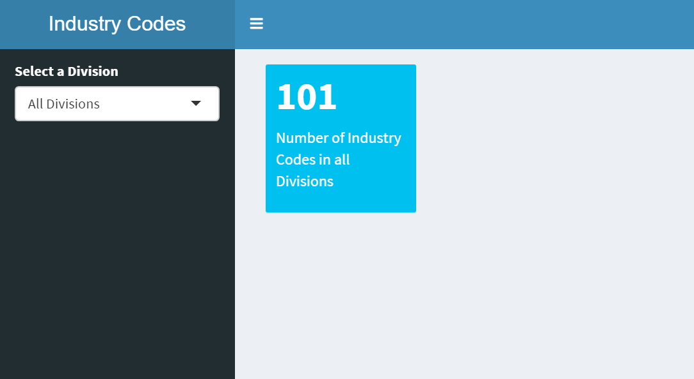

```{r setup, include=FALSE}
knitr::opts_chunk$set(echo = TRUE)
```

## R Dashboard Example
Here, I'm, using two seperate files, one to define the user interface (which has to be named `ui.r`), and another one that defines the server function, which has to be named `server.r`. Both files need to be in the same directory. In that directory, you clould also including a csv file named 'NCalum.csv` that contains the data for this app. *However*, here we would like to read that file remotely from a github directory. We could then simply use

`read_csv(file = https://raw.githubusercontent.com/bklingen/DataViz2022/main/Data/NCAlumn.csv)`

However, we want the dashboard to continually probe this file, and reload it in case any changes were made. This is achieved with the `reactiveFileReader` command, that will check every 100 seconds if the file has changed, and if it did, reload it. This happens even while the dashboard is running. (On the other hand, had we just used `read_csv`, th efile would have been loaded only once, when the dashboard app is started, but not reloaded while the dashboard app is running.)

ui.r file:
```{r eval=FALSE}
library(shiny)
library(shinydashboard)

dashboardPage(
    
    dashboardHeader(title="Industry Codes"),
    
    dashboardSidebar(
        
        selectInput("Division",
                    "Select a Division",
                    choices=c("All Divisions" = "all",
                              "Natural Sciences" = "Natural Sciences",
                              "Social Sciences" = "Social Sciences",
                              "Humanities" = "Humanities",
                              "Interdisciplinary" = "Interdisciplinary"))
    ),
    
    dashboardBody(
        valueBoxOutput("nCodes")
    )
    
)
```

server.r file:
```{r eval=FALSE}
library(shiny)
library(shinydashboard)
library(readr)
library(dplyr)

shinyServer(function(input, output, session) {
    
    df <- reactiveFileReader(
        intervalMillis = 20000,
        session = session,
        filePath = 'https://raw.githubusercontent.com/bklingen/DataViz2022/main/Data/NCAlumn.csv',
        readFunc = read_csv
    )
    
    output$nCodes <- renderValueBox({
        
        if(input$Division=="all") {
            uniqueCats <- df() %>% select(Industry) %>%
                distinct() %>%
                count()
        } else {
            uniqueCats <- df() %>% select(DIVISION_1, Industry) %>%
                filter(DIVISION_1 == input$Division) %>%
                select(Industry) %>%
                distinct() %>%
                count()
        }
        
        valueBox(
            value = uniqueCats,
            subtitle = paste("Number of Industry Codes in ", 
                             ifelse(input$Division=="all", 
                                    "all Divisions", 
                                    input$Division))
        )
    })
    
})
```

This will create the following dashboard app:

{width=70%}

